<div align="center">
  

# Nammu OS

**A browser-native operating system for focused work, creative tools, cloud files, and the open web.**

Nammu OS turns a web page into a coherent personal workstation: movable application windows, a real taskbar and launcher, a WebAssembly browser engine, multi-cloud storage, media tools, productivity apps, themes, wallpapers, lock-screen controls, and a persistent audio workspace.

[](https://github.com/nammu-os/nammu-os/actions/workflows/ci.yml)
[](https://nextjs.org/)
[](https://react.dev/)
[](https://www.typescriptlang.org/)
[](https://bun.sh/)
[](https://tailwindcss.com/)

  <br />
  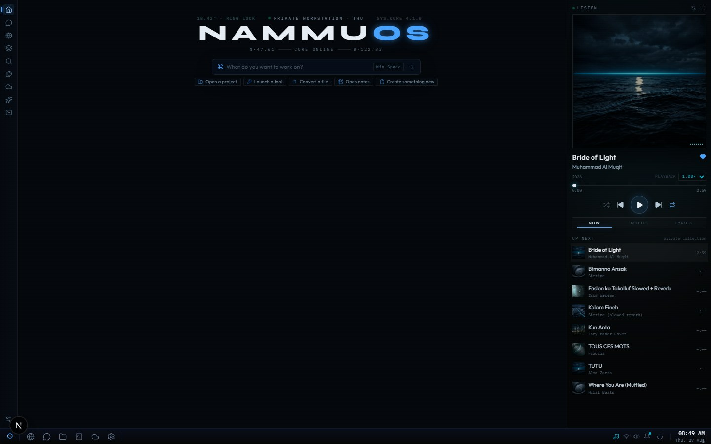
</div>

---

## A workstation, not another dashboard

Nammu OS is built around one idea: tools should feel like parts of the same environment. Apps share the windowing model, visual language, theme system, master audio, global icon settings, taskbar, start menu, context menus, standalone routes, and saved preferences. The result behaves like a small operating system while remaining deployable as a modern web application.

| Desktop experience                                                                                                             | Open web                                                                                                                                                                   | Files everywhere                                                                                                                   | Native toolbox                                                                                                         |
| ------------------------------------------------------------------------------------------------------------------------------ | -------------------------------------------------------------------------------------------------------------------------------------------------------------------------- | ---------------------------------------------------------------------------------------------------------------------------------- | ---------------------------------------------------------------------------------------------------------------------- |
| Multi-window workspace, snapping, persisted geometry, taskbar, launcher, lock screen, themes, wallpapers, and global controls. | A Nammu-styled multi-tab browser powered by a Gecko WebAssembly runtime, with history, downloads, bookmarks, passwords, private tabs, pinning, and split-window workflows. | Files and an aggregated cloud workspace for Google Drive, OneDrive, Dropbox, MEGA, pCloud, Yandex Disk, and S3-compatible storage. | **127 registered tools** across image, video, audio, PDF and documents, developer utilities, and everyday conversions. |

## Built to feel like one product

- **Desktop shell** — draggable and resizable windows, predictable default geometry, minimize/maximize, snapping, focus management, standalone app routes, a reorderable start menu, draggable taskbar and rail icons, and middle-click close.
- **Browser and WhatsApp runtimes** — each app prepares one long-lived Gecko WebAssembly engine per application session instead of repeatedly starting an engine for every tab.
- **Unified appearance** — Cyber Glow, Obsidian Dark, Midnight Navy, and macOS themes, with system-wide light/dark appearance, accent colors, CRT scanlines, icon controls, and motion preferences.
- **Living wallpapers** — configurable Synth Rain and Chaos Flow Matrix effects with color, speed, and size controls.
- **Audio workspace** — persistent music player, queue, playback modes, playback speed, transparency controls, visualization, and local volume combined with the OS master volume.
- **Local-first personalization** — notes, calendar entries, browser state, ordering, settings, lock profile, wallpaper controls, and other preferences survive reloads without turning the interface into a collection of disconnected pages.
- **Accessible application routes** — system apps and tools can also open directly at `/apps/:id` and `/tools/:id`, with deterministic server rendering and safe browser-state hydration.

## Selected interfaces

### Projects is a portfolio, not a task tracker

The Projects app presents shipped work as an equal-weight developer portfolio grid. It includes live previews, search, product-category filters, technology tags, open-in-new-tab and copy-link actions, and an extensible data collection for future projects.

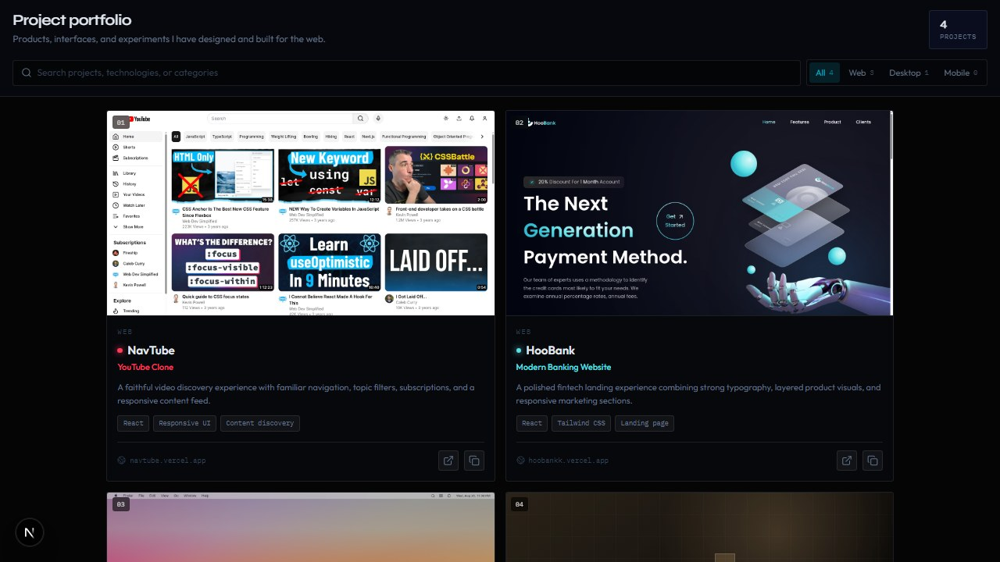

The initial collection includes:

- [NavTube — YouTube Clone](https://navtube.vercel.app/)
- [HooBank — Modern Banking Website](https://hoobankk.vercel.app/)
- [macOS Clone — Browser Desktop Experience](https://nammu-os.vercel.app/)
- [Timeless Pages — Online Bookstore](https://timeless-pages.vercel.app/)

Future entries live in [`src/lib/portfolioProjects.ts`](./src/lib/portfolioProjects.ts), so adding work automatically updates the gallery, search, counts, and category filters.

### A complete browser inside the workspace

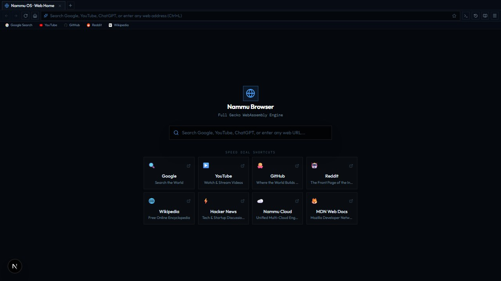

Nammu Browser wraps the Firefox/Gecko WebAssembly runtime in the same interface and tab system as the rest of Nammu OS. Engine lifecycle is application-scoped, pinned tabs collapse properly, navigation history is reconciled without duplicate entries, and the full browser can be opened in its own tab at `/browser`.

### One view across multiple cloud providers

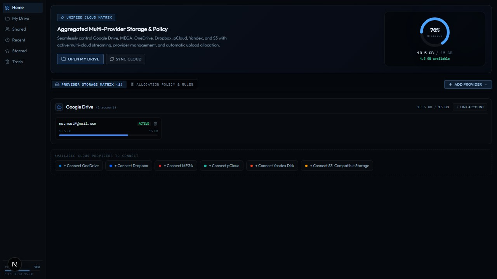

Cloud combines provider accounts, capacity, allocation policy, upload routing, sync, file operations, previews, trash, recents, sharing, and account health into one workspace. Provider adapters and route handlers keep UI concerns separate from storage logic.

### Maps and system personalization

<table>
  <tr>
    <td width="50%">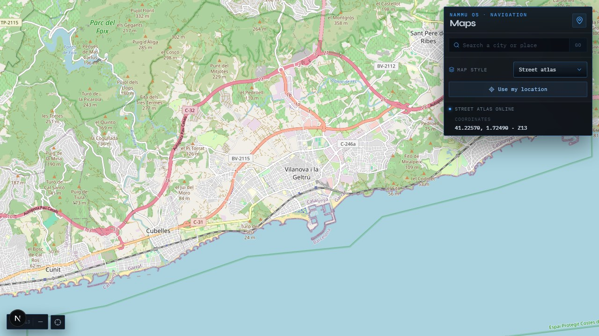</td>
    <td width="50%">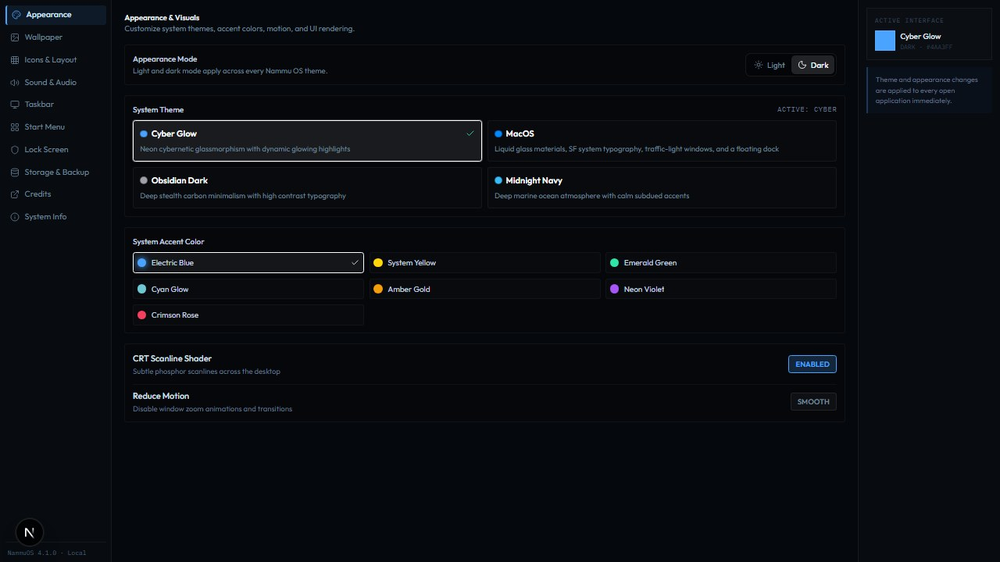</td>
  </tr>
  <tr>
    <td><strong>Maps</strong><br /><sub>Street Atlas mapping, search, location, coordinates, zoom controls, and carefully themed map chrome.</sub></td>
    <td><strong>Settings</strong><br /><sub>Appearance, wallpaper, icons, audio, taskbar, start menu, lock screen, storage, credits, and system information.</sub></td>
  </tr>
</table>

## Application gallery

Every primary application uses the same standalone shell and can be opened independently without losing Nammu OS styling or browser-backed state.

<details open>
  <summary><strong>Core workspace</strong></summary>
  <br />
  <table>
    <tr>
      <td width="50%">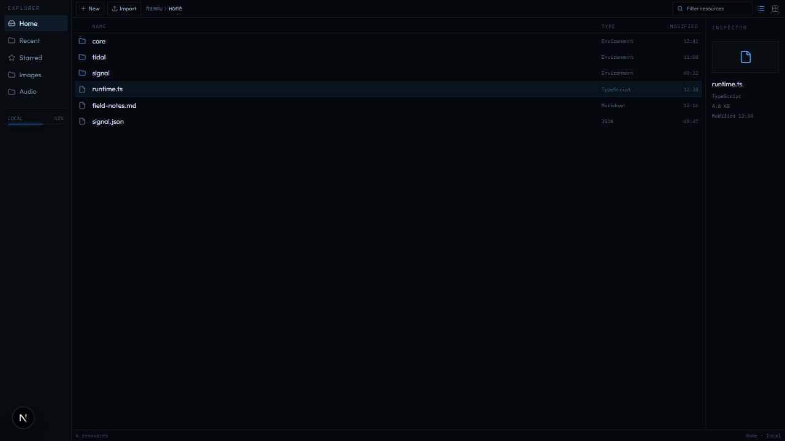<br /><strong>Files</strong><br /><sub>Folders, uploads, previews, metadata, downloads, and trash.</sub></td>
      <td width="50%"><br /><strong>Cloud</strong><br /><sub>Multi-provider storage, policies, connections, and sync.</sub></td>
    </tr>
    <tr>
      <td><br /><strong>Browser</strong><br /><sub>Gecko WebAssembly browsing with a native Nammu tab model.</sub></td>
      <td>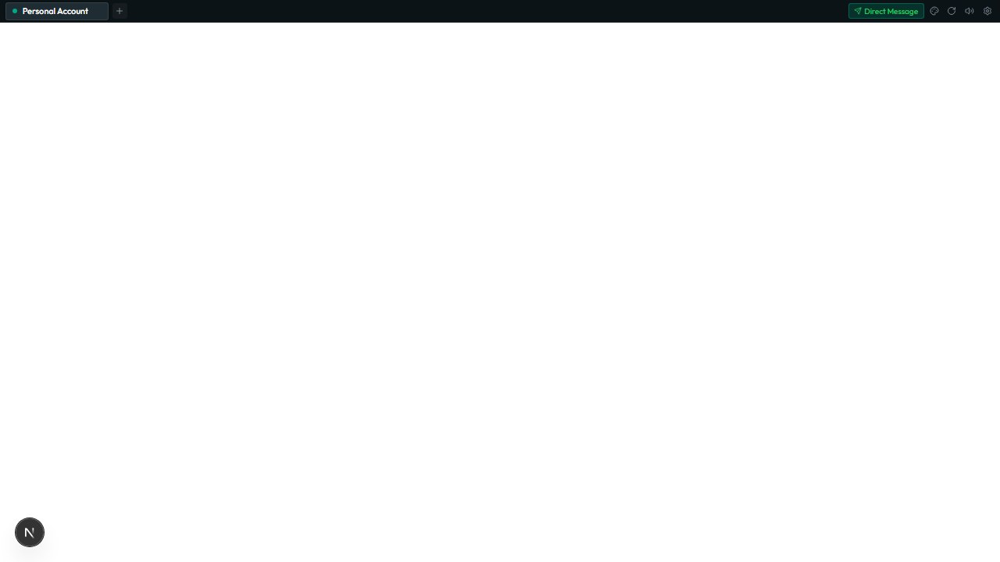<br /><strong>WhatsApp</strong><br /><sub>A focused QR-based WhatsApp Web session without browser chrome.</sub></td>
    </tr>
  </table>
</details>

<details>
  <summary><strong>Productivity and communication</strong></summary>
  <br />
  <table>
    <tr>
      <td width="50%">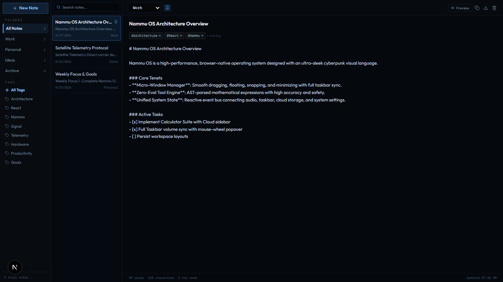<br /><strong>Notes</strong><br /><sub>Persistent notes with search, organization, and a focused editor.</sub></td>
      <td width="50%">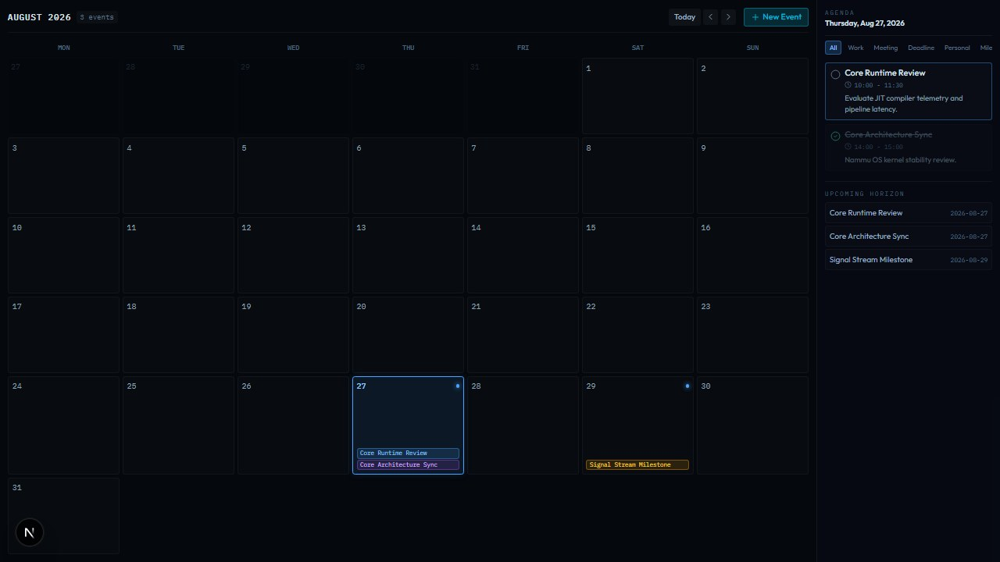<br /><strong>Calendar</strong><br /><sub>Month navigation, current-date context, events, and scheduling.</sub></td>
    </tr>
    <tr>
      <td>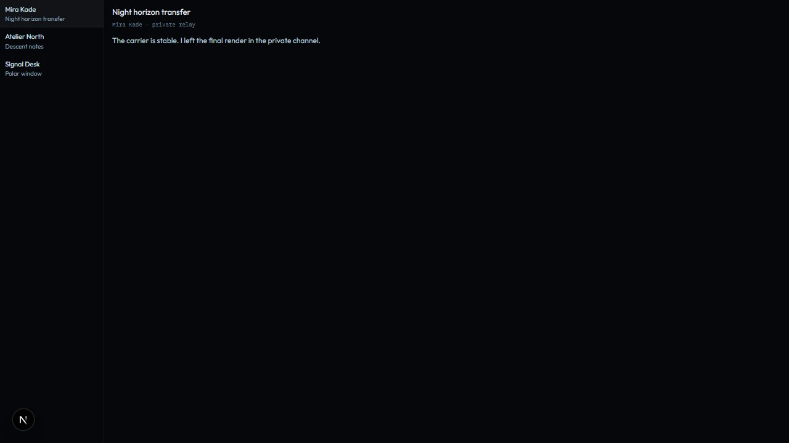<br /><strong>Mail</strong><br /><sub>A compact relay-style inbox and message reader.</sub></td>
      <td><br /><strong>Projects</strong><br /><sub>A visual developer portfolio for shipped websites and applications.</sub></td>
    </tr>
  </table>
</details>

<details>
  <summary><strong>Creation and development</strong></summary>
  <br />
  <table>
    <tr>
      <td width="50%">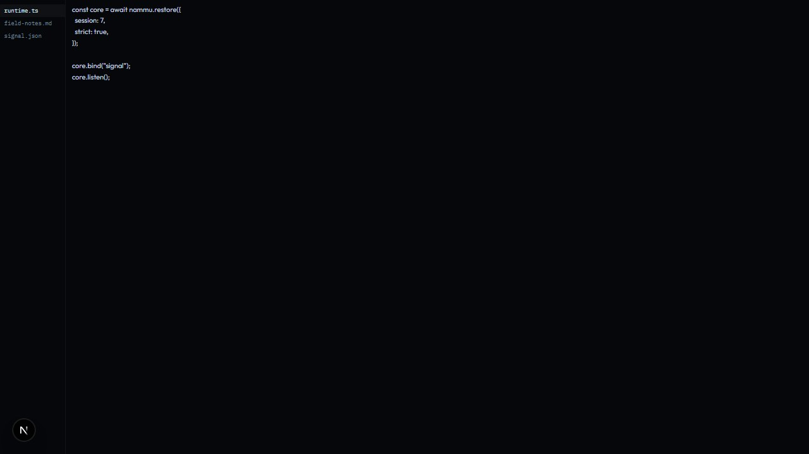<br /><strong>Editor</strong><br /><sub>A lightweight code and text workspace.</sub></td>
      <td width="50%">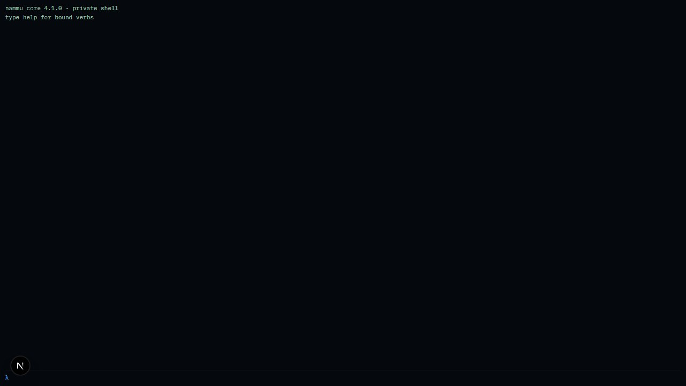<br /><strong>Shell</strong><br /><sub>A command-oriented workspace with OS-aware shortcuts.</sub></td>
    </tr>
    <tr>
      <td>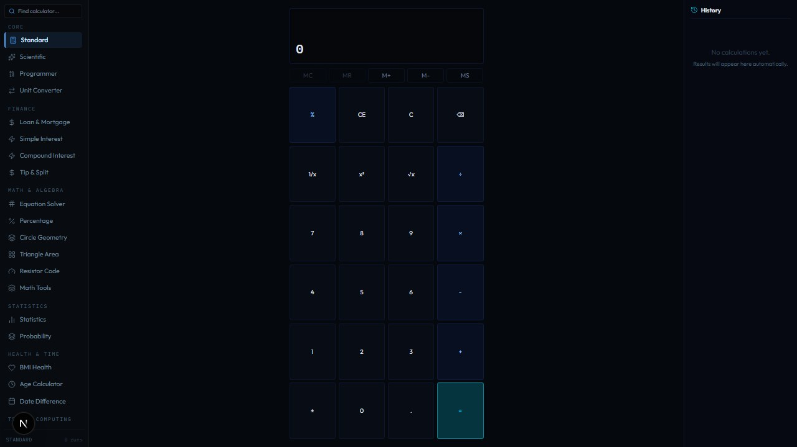<br /><strong>Calculator</strong><br /><sub>Standard, scientific, programmer, conversion, finance, and statistics modes.</sub></td>
      <td>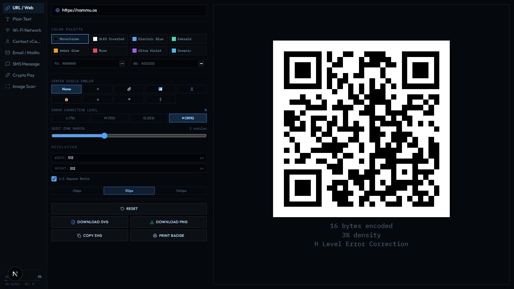<br /><strong>QR Studio</strong><br /><sub>Create styled QR codes, export assets, and scan compatible input.</sub></td>
    </tr>
  </table>
</details>

<details>
  <summary><strong>Intelligence, navigation, and control</strong></summary>
  <br />
  <table>
    <tr>
      <td width="50%">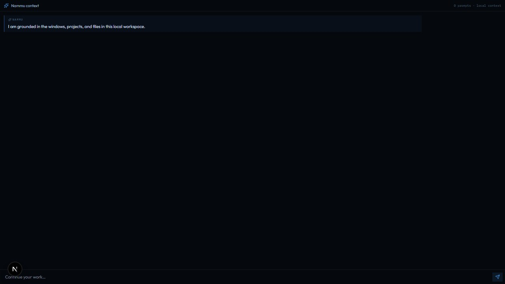<br /><strong>Nammu AI</strong><br /><sub>An assistant surface grounded in the local workspace.</sub></td>
      <td width="50%"><br /><strong>Maps</strong><br /><sub>Place search, geolocation, coordinates, styles, and navigation controls.</sub></td>
    </tr>
    <tr>
      <td colspan="2"><br /><strong>Settings</strong><br /><sub>A single control center for the full operating-system experience.</sub></td>
    </tr>
  </table>
</details>

## 127 native tools

The tool registry spans six focused families: **Image**, **Video**, **Audio**, **PDF & Documents**, **Developer**, and **Utilities**. Tools are searchable from the launcher, discoverable by compatible file type, and available as standalone `/tools/:id` routes.

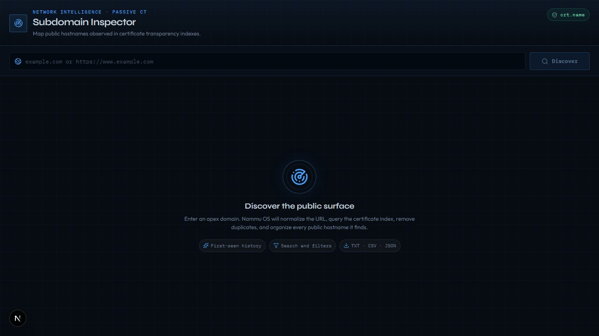

Examples include image conversion and compression, video and audio processing, PDF merge/split/watermark/password workflows, JSON and CSV utilities, regular expressions, hashing, JWT inspection, network calculators, UUID generation, color tools, text transforms, and the passive certificate-transparency **Subdomain Inspector**.

## Architecture

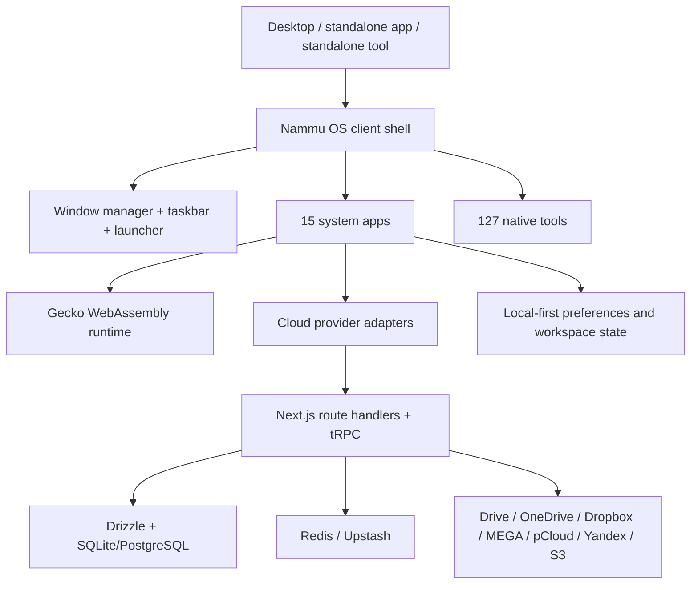
```mermaid
flowchart TB
  User[Desktop / standalone app / standalone tool] --> Shell[Nammu OS client shell]
  Shell --> Windows[Window manager + taskbar + launcher]
  Shell --> Apps[15 system apps]
  Shell --> Tools[127 native tools]
  Apps --> Gecko[Gecko WebAssembly runtime]
  Apps --> Cloud[Cloud provider adapters]
  Apps --> Local[Local-first preferences and workspace state]
  Cloud --> Routes[Next.js route handlers + tRPC]
  Routes --> Data[Drizzle + SQLite/PostgreSQL]
  Routes --> Cache[Redis / Upstash]
  Routes --> Providers[Drive / OneDrive / Dropbox / MEGA / pCloud / Yandex / S3]
```

| Layer          | Technology                                                                             |
| -------------- | -------------------------------------------------------------------------------------- |
| Application    | Next.js 16.3 App Router, React 19.2, TypeScript 5.9                                    |
| Interface      | Tailwind CSS 4, Framer Motion, Lucide icons, custom OS design tokens                   |
| Runtime        | Bun 1.3, Node-compatible custom Express server, WebSockets                             |
| APIs           | Next.js route handlers, tRPC 11, TanStack Query, Zod                                   |
| Data           | Drizzle ORM, SQLite for local development, PostgreSQL/Supabase, Redis/Upstash          |
| Browser engine | Firefox/Gecko compiled to WebAssembly with Wisp transport                              |
| Infrastructure | Docker, Docker Compose, Kubernetes manifests, Cloudflare configuration, GitHub Actions |

## Run it locally

### Requirements

- [Bun](https://bun.sh/) 1.3 or newer
- A Chromium-compatible browser; Microsoft Edge is used by the screenshot automation on Windows
- Optional PostgreSQL and Redis services for the full backend stack

### Development

```bash
git clone https://github.com/nammu-os/nammu-os.git
cd nammu-os
bun install

# Configure database and optional provider credentials
cp .env.example .env

bun run dev
```

Open [http://localhost:3000](http://localhost:3000).

### Full Docker stack

```bash
docker compose up -d --build
```

This starts Nammu OS with PostgreSQL 16 and Redis 7 using the included health checks and persistent volumes.

## Quality workflow

```bash
bun test             # Unit and regression suite
bun run typecheck    # Strict TypeScript validation
bun run lint         # ESLint
bun run format:check # Prettier verification
bun run build        # Optimized Next.js production build
```

The test suite covers window geometry, standalone routes, hydration safety, browser history reconciliation, app ordering, context-menu placement, storage allocation, cryptography, MIME handling, master audio, music settings, lock credentials, icons, tools, and the project portfolio collection.

### Refresh the documentation gallery

With the development server running:

```bash
bun run docs:screenshots
```

The capture script opens each Nammu OS route in a clean headless browser profile and regenerates the images in `docs/screenshots`. That keeps this README tied to the product that actually ships.

## Repository map

```text
src/
|-- app/                    Next.js pages, standalone routes, APIs, and actions
|-- components/
|   |-- desktop/            Desktop shell and standalone application boundary
|   |-- os/                 System apps, windows, taskbar, launcher, settings, music
|   |-- browser/            Nammu Browser UI and Gecko session orchestration
|   |-- cloud/              Multi-cloud workspace, provider views, uploads, previews
|   |-- maps/               Map interface and map-specific styling
|   `-- whatsapp/           Focused WhatsApp runtime and session store
|-- lib/                    Registries, preferences, ordering, geometry, runtime helpers
|-- server/                 tRPC routers, cloud adapters, allocation, crypto, MIME services
`-- tools/                  Image, video, audio, PDF, developer, and utility tools

docs/screenshots/           Reproducible product gallery used by this README
drizzle/                    Database migrations and snapshots
k8s/                        Deployment, service, ingress, autoscaling, and configuration
scripts/                    Runtime patching and documentation automation
tests/                      Unit and regression coverage
```

## Credits

Nammu OS stands on excellent open-source work. The in-product Credits page contains the complete, maintained attribution list. Core acknowledgements include:

- [HeyPuter/firefox-wasm](https://github.com/HeyPuter/firefox-wasm) — Firefox/Gecko WebAssembly foundation
- [dimartarmizi/OmniCloud](https://github.com/dimartarmizi/OmniCloud) — multi-cloud product inspiration
- [Saganaki22/SynthRain](https://github.com/Saganaki22/SynthRain) — Synth Rain wallpaper inspiration
- [Yufok1/Matrix-Rain-HTML-Background](https://github.com/Yufok1/Matrix-Rain-HTML-Background) — Chaos Flow wallpaper inspiration
- [Leaflet](https://leafletjs.com/), [OpenStreetMap contributors](https://www.openstreetmap.org/copyright), and [CARTO](https://carto.com/attributions) — map rendering and data
- [Lucide](https://lucide.dev/) — interface icon system

Third-party projects remain subject to their own licenses and attribution requirements.

---

<div align="center">
  <strong>Nammu OS is an evolving personal workstation built in public.</strong><br />
  <sub>Designed as one system. Shipped as the web.</sub>
</div>
